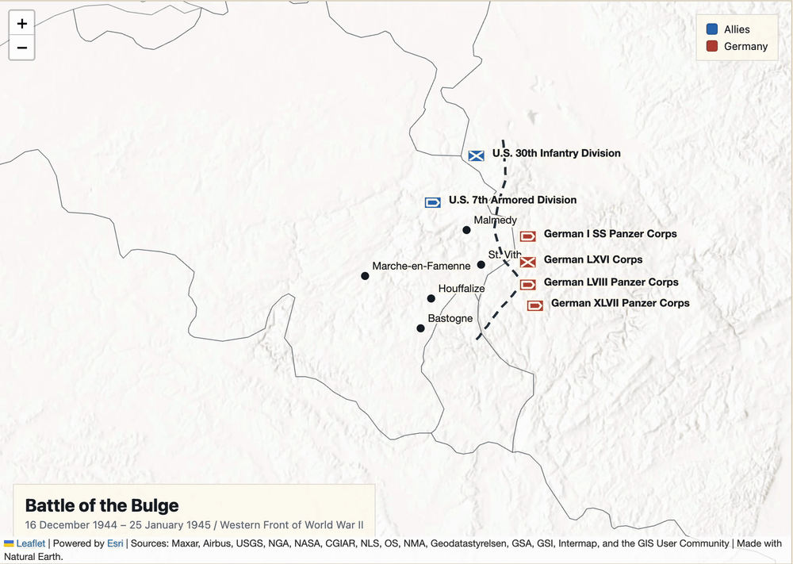

# Battle Animation Platform

This project defines a structured JSON format for describing an entire historical battle and provides a web player that can load and replay that format as a timeline-based map animation.

A battle JSON can record opposing sides, commanders, units, places, chronology, movements, engagements, outcomes, sources, and source-backed frontline snapshots. The format keeps uncertainty and source attribution explicit so unsupported reconstruction is not presented as fact.

The repository also provides a maintained AI generation prompt. It can be used in general-purpose chat interfaces such as ChatGPT, Claude, or Gemini to turn historical source material into a compatible battle JSON. **The player itself does not generate JSON.** This workflow avoids implementing a custom animation—or using a coding agent—for every battle, reducing the cost of producing individual battle visualizations.

## Example



*Battle of the Bulge example rendered from a structured battle JSON document.*

## Core pieces

- **Battle JSON Schema** — defines how an entire battle is represented in one structured document.
- **Web player** — loads a compatible JSON document and plays it as an interactive timeline-based map animation.
- **AI generation prompt** — helps create compatible battle JSON in ordinary AI chat interfaces without requiring a coding agent.

## Versions

| Component | Current version | Notes |
| --- | --- | --- |
| Battle JSON Schema | `0.4.0` | Current format for new battle documents |
| Battle JSON Prompt | `1.3.2` | Maintained AI generation prompt |
| Legacy schema support | `0.1.0`–`0.3.0` | Supported for reading older documents |

## Quick start

1. Prepare a battle JSON document using an [`example`](examples/) or the [Battle JSON generation prompt](docs/battle-json-prompt.md).
2. Validate it:

   ```bash
   python3 -m battle_animation.validator path/to/your-battle.json
   ```

3. Start a local static server:

   ```bash
   python3 -m http.server 8000
   ```

4. Open `http://localhost:8000/app/` and load the JSON document.

## Battle JSON at a glance

Schema `0.4.0` uses these required top-level sections:

```text
schema_version, metadata, battle, sides, commanders, actors, places,
historical_events, movements, outcome, sources, animation_hints
```

Optional sections include `engagements` and `frontline_snapshots`.

The schema separates source-backed historical claims from presentation hints. Uncertain or inferred data should remain explicitly marked with fields such as `precision` and `confidence`.

See [`schemas/battle-animation-schema.json`](schemas/battle-animation-schema.json) for the complete format and [`examples/`](examples/) for full documents.

## Playback and map display

- **Guided playback** is enabled by default and presents the battle event by event. Disable it to return to continuous timeline playback.
- The map shows units only when the current event contains sufficient position or movement data. A unit not shown on the map does not imply that it did not participate; its location data may simply be insufficient for that period.
- **Focus event** centers the map on the current event. If the JSON provides a `camera` hint, the player gives that view priority.
- Movement trails are disabled by default. When enabled, only the current event's movement path is shown. Interpolation between source-backed frontline anchors is a visualization effect and does not imply that historical sources provide those intermediate states.

## Repository layout

- `schemas/` — Battle JSON schema definitions.
- `app/` — browser-based battle player.
- `examples/` — complete battle JSON examples.
- `docs/battle-json-prompt.md` — maintained AI generation prompt.
- `battle_animation/validator.py` — schema and reference validator.
- `tests/` — contract tests.

Run the tests with:

```bash
python3 -m unittest tests/test_mvp_contract.py -v
```

## License

MIT License. See [`LICENSE`](LICENSE).
